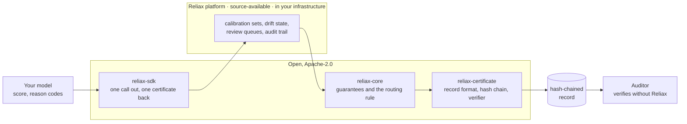

# Reliax

**One call out, one certificate back.** Reliax assesses a scoring model's
predictions one decision at a time. It sits beside the model, without
retraining it or touching its weights, and attaches to each prediction a
certificate that says whether this answer can be relied on at a guaranteed
error rate, whether that guarantee covers this input, and whether the
population has moved. Each decision is then routed to ALLOW, REVIEW or BLOCK.
The routing rule looks only at what the certificate guarantees, and the
thresholds it applies come from a policy that you write and keep under
version control.



- **ALLOW.** The decision can be acted on automatically
- **REVIEW.** The certificate holds but the case fails one of the
thresholds in your own policy, such as an ambiguous prediction set or a
bracket above your approve ceiling, so a person decides with the model's
answer and the certificate in front of them. 
- **BLOCK.** The assessment itself is no longer reliable: the population has drifted or the
input lies outside what was calibrated, so neither the model nor Reliax's
certificate is competent for this  case, and a person decides without relying
on either.

The first target is credit risk, where decisions are individually
consequential and already regulated.

## Try it locally

The method is a plain Python package and runs on its own. This example trains a
model on synthetic data, calibrates it, and routes one decision:

```
pip install reliax-core
```

```python
import numpy as np
from sklearn.linear_model import LogisticRegression
from reliax_core import ConformalCalibrator, KNNOODDetector, CredibilityReference, Policy, Envelope, evaluate

rng = np.random.default_rng(0)
X = rng.normal(size=(3000, 4)); y = (X @ [1.2, -0.8, 0.5, 0.3] + rng.normal(size=3000) > 0).astype(int)
model = LogisticRegression().fit(X[:2000], y[:2000])          # your model, trained as usual
X_cal, y_cal = X[2000:], y[2000:]                              # a held-out calibration split

sets = ConformalCalibrator(model.predict_proba(X_cal), y_cal)  # the coverage guarantee
detector = KNNOODDetector().fit(X_cal)
credibility = CredibilityReference.from_detector(detector)     # "does the guarantee cover this input?"
policy = Policy(alpha=0.05, credibility_extreme=0.005)         # the thresholds you set

def route(x):
    env = Envelope(credibility=credibility.p_value(detector.distance(x)),
                   prediction_set=sets.prediction_set(model.predict_proba([x])[0], alpha=policy.alpha))
    d = evaluate(policy, env)
    print(f"{d.route:6} {'; '.join(d.certificate_reasons)}")

route(np.array([2.0, -1.5, 1.0, 0.5]))     # a clear case
route(X[0])                                # a borderline case
route(np.array([40.0, 40.0, 40.0, 40.0]))  # nothing like the calibration data
```

```
ALLOW  input within the scope of the guarantee; one label left standing
REVIEW 2 labels left standing: the model cannot separate them for this case
BLOCK  input outside the scope of the guarantee: credibility 0.001 below the extreme floor 0.005
```

The route comes from six checks read in a fixed order; the first that fails
sets the route, and the record keeps the list of checks read on the way (the
route trace).

1. Is the guarantee active on this segment? No drift alarm, no model or
   calibration-set mismatch. Otherwise BLOCK.
2. Is the input covered by the guarantee? Credibility at or above the policy
   floor. Below the floor REVIEW; below the extreme floor BLOCK.
3. Does the prediction set contain exactly one label? Otherwise REVIEW.
4. If the model says approve, does the calibrated default probability stay
   under your approve cap, even at the top of its bracket? Otherwise REVIEW.
5. Is the stream free of a drift WATCH? Otherwise REVIEW, if the policy says so.
6. Otherwise ALLOW.

The first input passes all six. The second is covered by the guarantee but
both labels are left standing at the 95% level, so check 3 sends it to a
person with the model's answer in front of them. The third sits farther from
the calibration data than any calibration row does, so check 2 fires at the
extreme floor and a person decides without the model. The same example, with
the module table behind it, is the
[quick start in reliax-core](https://github.com/reliax-io/reliax-core#quick-start).

## With the platform

The client talks to a running Reliax platform, which holds the calibration
cohorts, the drift state and the record store. Installing the client alone
does nothing until it is pointed at one.

```
pip install reliax-sdk
```

```python
import reliax

reliax.configure("https://reliax.internal.example", api_key="...")   # your platform instance
out = reliax.assess(
    {"income": 54000, "dti": 0.31},                                     # the model input
    reliax.Context(score=0.04, segment="thin-file"),                    # score: your model's output
)
print(out.route, out.reason_codes)   # ALLOW ['CERTIFIED']
print(out.certificate_text)          # the wording stored on the record, verbatim
```

The platform runs inside your own infrastructure and is licensed per
deployment. To run a pilot or evaluate it on your book, write to
**contact@reliax.io**.

What comes back, stored verbatim on a hash-chained record:

```
Certificate · rxe_7f3a9b · credit PD · 2026-09-10T09:14:07Z
Prediction set {repay}, produced by a procedure that on calibration cohort C
(n = 7,500, frozen 2026-06-30, sha256 3f9a…) contains the true outcome at least 95% of the time.
Credibility 0.61: this input is consistent with cohort C. Exchangeability: no alarm.
Routing: ALLOW under policy credit-pd@4 · row 6 matched, so every check above it passed.
Read this correctly: this is not a probability that this applicant turns out well.
```

Anyone can check a record without Reliax, and the verifier works if Reliax no
longer exists:

```
pip install reliax-certificate
reliax verify record.json
