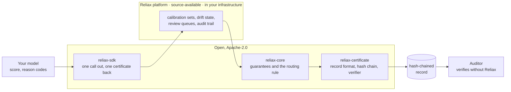

# Reliax

**One call out, one certificate back.** Reliax assesses a scoring model's
predictions one decision at a time. It sits beside the model, without
retraining it or touching its weights, and attaches to each prediction a
certificate that says whether this answer can be relied on at a guaranteed
error rate, whether that guarantee covers this input, and whether the
population has moved. Each decision is then routed to ALLOW, REVIEW or BLOCK.
The routing rule looks only at what the certificate guarantees, and the
thresholds it applies come from a policy that you write and keep under
version control.



- **ALLOW.** The decision can be acted on automatically
- **REVIEW.** The certificate holds but the case fails one of the
thresholds in your own policy, such as an ambiguous prediction set or a
bracket above your approve ceiling, so a person decides with the model's
answer and the certificate in front of them. 
- **BLOCK.** The assessment itself is no longer reliable: the population has drifted or the
input lies outside what was calibrated, so neither the model nor Reliax's
certificate is competent for this  case, and a person decides without relying
on either.

The first target is credit risk, where decisions are individually
consequential and already regulated.

## Try it locally

The method is a plain Python package and runs on its own. This example trains a
model on synthetic data, calibrates it, and routes one decision:

```
pip install reliax-core
```

```python
import numpy as np
from sklearn.linear_model import LogisticRegression
from reliax_core import ConformalCalibrator, KNNOODDetector, CredibilityReference, Policy, Envelope, evaluate

rng = np.random.default_rng(0)
X = rng.normal(size=(3000, 4)); y = (X @ [1.2, -0.8, 0.5, 0.3] + rng.normal(size=3000) > 0).astype(int)
model = LogisticRegression().fit(X[:2000], y[:2000])          # your model, trained as usual
X_cal, y_cal = X[2000:], y[2000:]                              # a held-out calibration split

sets = ConformalCalibrator(model.predict_proba(X_cal), y_cal)  # the coverage guarantee
detector = KNNOODDetector().fit(X_cal)
credibility = CredibilityReference.from_detector(detector)     # "does the guarantee cover this input?"
policy = Policy(alpha=0.05, credibility_extreme=0.005)         # the thresholds you set

def route(x):
    env = Envelope(credibility=credibility.p_value(detector.distance(x)),
                   prediction_set=sets.prediction_set(model.predict_proba([x])[0], alpha=policy.alpha))
    d = evaluate(policy, env)
    print(f"{d.route:6} {'; '.join(d.certificate_reasons)}")

route(np.array([2.0, -1.5, 1.0, 0.5]))     # a clear case
route(X[0])                                # a borderline case
route(np.array([40.0, 40.0, 40.0, 40.0]))  # nothing like the calibration data
```

```
ALLOW  input within the scope of the guarantee; one label left standing
REVIEW 2 labels left standing: the model cannot separate them for this case
BLOCK  input outside the scope of the guarantee: credibility 0.001 below the extreme floor 0.005
```

The route comes from six checks read in a fixed order; the first that fails
sets the route, and the record keeps the list of checks read on the way (the
route trace).

1. Is the guarantee active on this segment? No drift alarm, no model or
   calibration-set mismatch. Otherwise BLOCK.
2. Is the input covered by the guarantee? Credibility at or above the policy
   floor. Below the floor REVIEW; below the extreme floor BLOCK.
3. Does the prediction set contain exactly one label? Otherwise REVIEW.
4. If the model says approve, does the calibrated default probability stay
   under your approve cap, even at the top of its bracket? Otherwise REVIEW.
5. Is the stream free of a drift WATCH? Otherwise REVIEW, if the policy says so.
6. Otherwise ALLOW.

The first input passes all six. The second is covered by the guarantee but
both labels are left standing at the 95% level, so check 3 sends it to a
person with the model's answer in front of them. The third sits farther from
the calibration data than any calibration row does, so check 2 fires at the
extreme floor and a person decides without the model. The same example, with
the module table behind it, is the
[quick start in reliax-core](https://github.com/reliax-io/reliax-core#quick-start).

## With the platform

The client talks to a running Reliax platform, which holds the calibration
sets, the drift state and the record store. Installing the client alone
does nothing until it is pointed at one.

```
pip install reliax-sdk
```

```python
import reliax

reliax.configure("https://reliax.internal.example", api_key="...")   # your platform instance
out = reliax.assess(
    {"income": 54000, "dti": 0.31},                                     # the model input
    reliax.Context(score=0.04, segment="thin-file"),                    # score: your model's output
)
print(out.route, out.reason_codes)   # ALLOW ['CERTIFIED']
print(out.certificate_text)          # the wording stored on the record, verbatim
```

The platform runs inside your own infrastructure and is licensed per
deployment. To run a pilot or evaluate it on your book, write to
**contact@reliax.io**.

What comes back, stored verbatim on a hash-chained record:

```
Certificate · rxe_7f3a9b · credit PD · 2026-09-10T09:14:07Z
Prediction set {repay}, produced by a procedure that on calibration set C
(n = 7,500, frozen 2026-06-30, sha256 3f9a…) contains the true outcome at least 95% of the time.
Credibility 0.61: this input is consistent with calibration set C. Exchangeability: no alarm.
Routing: ALLOW under policy credit-pd@4 · row 6 matched, so every check above it passed.
Read this correctly: this is not a probability that this applicant turns out well.
```

Anyone can check a record without Reliax, and the verifier works if Reliax no
longer exists:

```
pip install reliax-certificate
reliax verify record.json

## Read this correctly

Coverage is a property of the procedure over the calibration set, not a
probability about any one prediction. Distribution-free per-instance
conditional coverage is not attainable. Nothing a certificate says is a
probability that a given decision is right, and no number on it should be
shown as a percentage next to a decision. The certificate format bans the
wording that would turn a statement about the calibration set into a personal one.

## Three kinds of output

Every field on a certificate carries one of three classes.

- **Guarantee.** A theorem that holds on exchangeable data at the stated level,
  with no assumption on the model. Routing rules read guarantees and nothing
  else.
- **Exact.** Recomputed bit for bit from the record, so an auditor can replay it.
- **Signal.** A measurement without such a proof. Signals order the review
  queue and inform recalibration; no routing rule reads them.

The certificate carries three guarantees and one exact output:

| What it answers | How | Class |
|---|---|---|
| Can this answer be relied on? | A prediction set that contains the true outcome at least 1−α of the time, marginally and per declared segment, from a frozen calibration set named with its size, date and hash. A calibrated bracket accompanies it at every score level. | guarantee |
| Does the guarantee cover this input? | The credibility of the input against the calibration set | guarantee |
| Has the population moved? | The drift test on the stream of inputs, which the certificate reports as "Exchangeability", plus the dated outcome recheck | guarantee |
| What was decided, and why? | The route, the rule row that matched, the route trace and the reason codes | exact |

## Terms

| Term | Meaning |
|---|---|
| Exchangeable data | Rows whose order carries no information: the calibration cases and a new case could have been shuffled without anyone noticing. Every guarantee here assumes this and nothing else. |
| Prediction set | The labels a certified procedure leaves standing for one input. At a 95% level the true label is in the set at least 95% of the time over exchangeable data. One label left standing is a usable answer; two is an ambiguous case. |
| Nonconformity score | A number saying how unusual a case looks against the calibration data. For labels it is one minus the model's probability of the true label; for inputs it is the distance to the nearest calibration rows. |
| Calibration set | The frozen set of past cases, with their outcomes, that a certificate's guarantee is computed on. Named on every certificate with its size, freeze date and hash. |
| Segment | A declared subgroup, such as thin-file applicants, that gets its own coverage check. The segment attribute is used for calibration only and never shown to the model. The per-segment construction is called Mondrian conformal in the literature. |
| Credibility | A p-value on the distance between an input and the calibration set: the share of calibration cases that sit at least as far from it as this one does. Low credibility means the guarantee has no evidence about this input. |
| Calibrated bracket | A pair of probabilities [p0, p1] around the model's own score, built so that one of the two is calibrated. Width is a per-decision warning. The construction is Venn-Abers. |
| Drift test | A running statistic on the stream of inputs that grows when new cases stop looking exchangeable with the calibration set. Its false-alarm rate is bounded however long it runs. The construction is a conformal test martingale; WATCH and ALARM are its two thresholds. |
| Outcome recheck | When outcomes land for past decisions, they are compared with what was claimed. The certificate names the date of the last recheck. |
| Policy | The thresholds a deployer sets: the coverage level, the credibility floors, the bracket ceiling, the action per rule. Kept as a signed version; a change is a new version. |
| Route trace | The list of rule rows that were read before one matched, stored on the record so the route can be replayed. |
| Guarantee, exact, signal | The three classes of output; see above. |

## Repositories

| Repository | What it is | Licence | Status |
|---|---|---|---|
| [`reliax-core`](https://github.com/reliax-io/reliax-core) | The method: conformal sets, the calibrated bracket, the drift test, the credibility p-value, the routing rule, and the advisory signals. Pure functions, no I/O. | Apache-2.0 | 0.2.1 |
| [`reliax-certificate`](https://github.com/reliax-io/reliax-certificate) | The certificate format: schema, hash chain, wording template, and the verifier. | Apache-2.0 | 0.1.0 |
| [`reliax-sdk`](https://github.com/reliax-io/reliax-sdk) | The client. | Apache-2.0 | 0.1.0 |
| [`reliax-evaluation`](https://github.com/reliax-io/reliax-evaluation) | Every number in the whitepaper, with the datasets, runners and pre-registration. | Apache-2.0 | Published |
| Reliax platform | Calibration builder, reliability engine, review queues, audit service, readable view, dashboard, domain packs. Runs inside your infrastructure. | Source-available | Not published here |

Anything that routes a decision or is written on the certificate is open. The
platform holds the state and the workflow.

## Results

Measured on two public credit datasets: Default of Credit Card Clients
(Taiwan, 30,000 applicants) and Statlog German Credit (1,000 applicants), both
from the UCI repository. Every figure is produced by a committed runner in
[`reliax-evaluation`](https://github.com/reliax-io/reliax-evaluation), and
the negative results are reported next to the positive ones.

| | Measured |
|---|---|
| Coverage at a 0.95 target | 0.9515 ± 0.0040 on the Taiwan dataset; 0.9532 ± 0.0167 on German Credit |
| Drift false alarms | 0 of 5 streams of unshifted applicants; a real subpopulation shift caught in 4 of 5 |
| Latency, full envelope | 8.0 ms median, 17.5 ms p95 |
| **Negative:** bad approvals caught under severe shift | Refer the 10% of decisions ranked least reliable, then count how many approved-then-defaulted cases that 10% contains. On the severe payment-delay split of the Taiwan data, the fused reliability score catches 2.3% of them and model confidence 7.8%, while referring at random catches 9.6%. The pre-registered target of twice the capture of model confidence was withdrawn for this reason. |

Full tables: the [whitepaper](https://reliax.io/whitepaper.html) and the
evaluation repository.

## Licensing

The method, the certificate format, the verifier and the client are
Apache-2.0 with its patent grant. An auditor replaying a certificate on their
own book is ordinary permitted use, with no licence to interpret.

The platform is what Reliax sells: the operated system around the open parts,
holding the calibration sets, the queues, the recalibration workflow and the signed
trail. It is source-available, runs inside the customer's infrastructure, and
is not published here. Its licence text and conversion terms are published
with the platform.

## Contributing

Read [`CONTRIBUTING.md`](https://github.com/reliax-io/.github/blob/main/CONTRIBUTING.md)
and open an issue before writing anything substantial. A CLA is required
before a first merge, because the platform is licensed separately.

Security and certificate-integrity issues go through
[`SECURITY.md`](https://github.com/reliax-io/.github/blob/main/SECURITY.md),
never a public issue.

## Elsewhere

Whitepaper and formatted results: [reliax.io](https://reliax.io)
